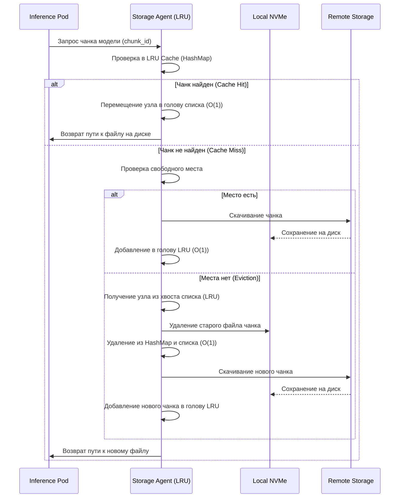

# Алгоритм LRU (Least Recently Used)

## Описание
Алгоритм LRU (Least Recently Used, «наименее недавно использовавшийся») представляет собой одну из наиболее распространенных и эффективных стратегий вытеснения данных из кэша. Основная идея алгоритма заключается в том, что если к каким-либо данным обращались недавно, то с высокой вероятностью к ним обратятся снова в ближайшем будущем. И наоборот, если данные не запрашивались дольше всего, вероятность их скорого использования минимальна, и именно их следует удалить при нехватке свободного места.

В контексте дипломной работы, посвященной оптимизации холодного старта и масштабирования моделей машинного обучения в бессерверном (serverless) инференсе, алгоритм LRU играет критически важную роль. Современные ML-модели, особенно большие языковые модели (LLM) или сложные сверточные нейронные сети, могут занимать гигабайты дискового пространства. При масштабировании бессерверных функций (например, подов в Kubernetes) загрузка таких моделей из удаленного объектного хранилища (например, S3) при каждом холодном старте приводит к неприемлемым задержкам, измеряемым десятками секунд или даже минутами.

Для решения этой проблемы в архитектуре системы предусмотрен компонент `storage-agent`, который управляет локальным кэшем чанков (фрагментов) ML-моделей на быстрых NVMe-дисках вычислительных узлов. Поскольку объем локального диска ограничен и не может вместить все возможные модели, необходимо эффективно управлять доступным пространством. Когда локальный диск заполняется, `storage-agent` использует алгоритм LRU для определения того, какой именно чанк модели следует удалить (вытеснить), чтобы освободить место для загрузки нового, более актуального чанка.

Классическая и наиболее оптимальная реализация алгоритма LRU базируется на совместном использовании двух структур данных: хеш-таблицы (HashMap) и двусвязного списка (Doubly Linked List). Двусвязный список хранит элементы кэша в порядке их использования: в голове списка (Front) находятся самые "свежие" (недавно использованные) элементы, а в хвосте (Back) — самые "старые" (наименее недавно использованные). Хеш-таблица, в свою очередь, хранит ключи (например, идентификаторы чанков) и указатели на соответствующие узлы в двусвязном списке. Это позволяет достичь константного времени выполнения основных операций.

## Сложность
Эффективность алгоритма LRU напрямую зависит от выбранных структур данных. Использование комбинации хеш-таблицы и двусвязного списка обеспечивает следующие показатели сложности:

**Временная сложность:**
*   **Поиск/Чтение (Get): O(1)**. Благодаря хеш-таблице мы можем за константное время найти указатель на узел в двусвязном списке. После нахождения узла, он перемещается в голову списка (так как к нему только что обратились), что в двусвязном списке также выполняется за O(1) путем перестроения нескольких указателей.
*   **Добавление/Обновление (Put): O(1)**. При добавлении нового элемента он помещается в голову списка, а в хеш-таблицу добавляется соответствующая запись. Если кэш переполнен, элемент из хвоста списка удаляется за O(1), и соответствующая запись удаляется из хеш-таблицы также за O(1).

**Пространственная сложность:**
*   **O(N)**, где N — максимальное количество элементов (чанков), которые могут храниться в кэше. Память расходуется на хранение самих данных (или метаданных) в узлах двусвязного списка, а также на хранение ключей и указателей в хеш-таблице. В контексте `storage-agent` накладные расходы на поддержание структур данных LRU ничтожно малы по сравнению с размером самих чанков ML-моделей (которые хранятся на диске, а в памяти хранится лишь их метаинформация).

## Диаграмма



## Реализация на Go

Ниже представлен абстрактный, но рабочий фрагмент кода на языке Go, демонстрирующий реализацию LRU-кэша для компонента `storage-agent`. Код показывает управление метаданными чанков.

```go
package lru

import (
	"container/list"
	"sync"
)

// ChunkMeta содержит метаданные чанка ML-модели
type ChunkMeta struct {
	ModelID string
	ChunkID string
	Size    int64
	Path    string // Путь на локальном диске
}

// LRUCache реализует потокобезопасный LRU кэш для чанков
type LRUCache struct {
	capacity int64 // Максимальный объем в байтах
	used     int64 // Текущий занятый объем
	items    map[string]*list.Element
	evictList *list.List
	mu       sync.Mutex
}

// entry - элемент, хранящийся в двусвязном списке
type entry struct {
	key   string
	chunk ChunkMeta
}

// NewLRUCache создает новый экземпляр LRU кэша
func NewLRUCache(capacityBytes int64) *LRUCache {
	return &LRUCache{
		capacity:  capacityBytes,
		used:      0,
		items:     make(map[string]*list.Element),
		evictList: list.New(),
	}
}

// Get возвращает метаданные чанка, если он есть в кэше
func (c *LRUCache) Get(key string) (ChunkMeta, bool) {
	c.mu.Lock()
	defer c.mu.Unlock()

	if ent, ok := c.items[key]; ok {
		c.evictList.MoveToFront(ent) // Помечаем как недавно использованный
		return ent.Value.(*entry).chunk, true
	}
	return ChunkMeta{}, false
}

// Put добавляет новый чанк в кэш, при необходимости вытесняя старые
func (c *LRUCache) Put(key string, chunk ChunkMeta) []ChunkMeta {
	c.mu.Lock()
	defer c.mu.Unlock()

	var evicted []ChunkMeta

	// Если чанк уже есть, обновляем его и перемещаем в начало
	if ent, ok := c.items[key]; ok {
		c.evictList.MoveToFront(ent)
		oldSize := ent.Value.(*entry).chunk.Size
		c.used += chunk.Size - oldSize
		ent.Value.(*entry).chunk = chunk
	} else {
		// Добавляем новый элемент
		ent := c.evictList.PushFront(&entry{key, chunk})
		c.items[key] = ent
		c.used += chunk.Size
	}

	// Вытесняем старые чанки, пока не освободится достаточно места
	for c.used > c.capacity && c.evictList.Len() > 0 {
		back := c.evictList.Back()
		if back != nil {
			evictedEntry := back.Value.(*entry)
			c.used -= evictedEntry.chunk.Size
			delete(c.items, evictedEntry.key)
			c.evictList.Remove(back)
			evicted = append(evicted, evictedEntry.chunk)
		}
	}

	return evicted // Возвращаем список вытесненных чанков для их физического удаления с диска
}
```

## Применение в системе

В разработанной архитектуре бессерверного инференса алгоритм LRU является ядром подсистемы управления локальным хранилищем на вычислительных узлах (Worker Nodes). Компонент `storage-agent`, работающий в виде DaemonSet в Kubernetes, использует этот алгоритм для поддержания актуального набора чанков моделей на локальных NVMe-накопителях.

Процесс выглядит следующим образом:
1.  Когда Kubernetes планирует запуск нового пода для инференса (например, при масштабировании от нуля — холодный старт), под запрашивает доступ к весам определенной ML-модели.
2.  Запрос перехватывается компонентом `storage-mounter` (обычно реализованным через CSI драйвер), который обращается к локальному `storage-agent`.
3.  `storage-agent` проверяет наличие необходимых чанков модели в своем LRU-кэше.
4.  Если происходит попадание в кэш (Cache Hit), чанк помечается как недавно использованный (перемещается в голову списка), и под мгновенно получает доступ к данным через локальное монтирование. Это радикально снижает время холодного старта, так как исключается сетевая задержка.
5.  Если происходит промах кэша (Cache Miss), `storage-agent` инициирует загрузку чанка из удаленного хранилища (S3 или Redis, если используется распределенный кэш).
6.  Перед сохранением нового чанка на диск, `storage-agent` проверяет доступный объем. Если места недостаточно, вызывается метод `Put` LRU-кэша, который определяет наименее востребованные чанки (находящиеся в хвосте списка).
7.  Вытесненные чанки физически удаляются с диска, освобождая место, после чего новый чанк сохраняется, а его метаданные добавляются в голову LRU-списка.

Такой подход гарантирует, что на узлах всегда хранятся те модели, которые в данный момент испытывают наибольшую нагрузку и часто запрашиваются пользователями. Модели, к которым давно не обращались, постепенно вытесняются, уступая место более актуальным. Это позволяет эффективно использовать ограниченные ресурсы быстрых локальных дисков и обеспечивать минимальное время отклика при динамическом масштабировании бессерверных функций, что является главной целью дипломной работы.