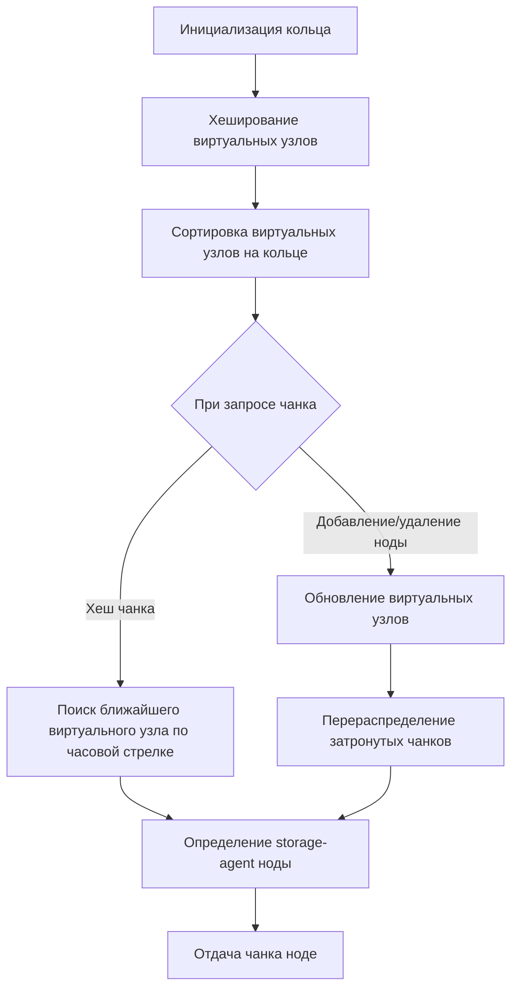

# Алгоритм консистентного хеширования с виртуальными узлами

## Описание

Консистентное хеширование — это алгоритм распределения данных по множеству узлов (нод) таким образом, чтобы минимизировать перераспределение данных при изменении количества узлов в кластере. В нашем случае задача состоит в эффективном распределении чанков моделей машинного обучения по storage-agent нодам в кластере для обеспечения масштабируемости и устойчивости системы.

Основная проблема классического хеширования заключается в значительной миграции данных при добавлении или удалении узла: большинство ключей приходится перераспределять заново, что приводит к простою и повышенной нагрузке на сеть и дисковую подсистему. Консистентное хеширование решает эту проблему, позволяя перераспределить лишь небольшой процент данных, обычно около 1/N от общего объёма, где N — количество узлов.

Алгоритм строит виртуальное кольцо хеш-пространства (0..2^32-1 или другой диапазон), на котором размещаются хеши узлов и ключей. Каждый ключ размещается на первом узле, чей хеш равен или следует за хешем ключа по часовой стрелке. Добавление или удаление узла меняет только границы соседних интервалов, минимально влияя на распределение.

Важным дополнением является использование виртуальных узлов (virtual nodes, vnode). Каждая физическая нода отображается на множество виртуальных узлов, размещаемых в разных точках кольца. Это сглаживает нагрузку: даже если физическая нода попадает в "горячую точку" кольца, её виртуальные узлы распределены по всему пространству, обеспечивая более равномерное распределение данных и повышения устойчивости к неравномерным пиковым нагрузкам.

В контексте дипломной работы консистентное хеширование применяется для распределения чанков моделей между storage-agent нодами в Kubernetes-кластере. При масштабировании (горизонтальном добавлении или удалении нод) алгоритм обеспечивает минимальное перераспределение чанков, что критично для уменьшения времени холодного старта и стабилизации инференса.

Интеграция с Kubernetes позволяет динамически отслеживать состояние storage-agent нод, а Redis используется как распределённое хранилище метаданных распределения и состояния моделей. Консистентное хеширование минимизирует обращения к Redis при изменениях топологии, снижая нагрузку на сеть и время отклика системы.

Пример: при добавлении новой storage-agent ноды в кластер, её виртуальные узлы размещаются на кольце, затрагивая лишь некоторые соседние интервалы ключей. Следовательно, перехешируются и мигрируют только чанки, хеш которых попадают в эти интервалы. Остальные чанки остаются на прежних нодах, что минимизирует накладные расходы и сокращает задержки инференса.

Таким образом, консистентное хеширование с виртуальными узлами — ключевой механизм для устойчивого, масштабируемого и эффективного распределения моделей в бессерверном инференсе.

## Сложность

### Временная сложность

- Поиск узла для ключа (чанка модели) осуществляется с помощью бинарного поиска по отсортированному массиву виртуальных узлов на кольце. При числе виртуальных узлов V, поиск занимает O(log V).
- Добавление или удаление узла требует вставки или удаления всех его виртуальных узлов — операция O(V_n * log V), где V_n — количество виртуальных узлов на одну физическую ноду.
- При масштабировании перераспределяется только O(1/N) ключей, где N — количество физических узлов.

### Пространственная сложность

- Хранение виртуальных узлов требует O(V) памяти, где V — общее количество виртуальных узлов во всём кластере (обычно V = N * V_n).
- Для хранения метаданных распределения в Redis используется дополнительная память, пропорциональная числу нод и виртуальных узлов.

Обоснование: использование виртуальных узлов увеличивает общее число элементов, но обеспечивает балансировку нагрузки. При этом логарифмическая временная сложность поиска и минимальное перераспределение данных делают алгоритм очень эффективным для динамических систем с частыми изменениями топологии, как в Kubernetes.

## Диаграмма



## Реализация на Go

```go
package consistenthash

import (
    "hash/crc32"
    "sort"
    "sync"
    "strconv"
)

// HashFunc определяет тип функции хеширования
type HashFunc func(data []byte) uint32

type HashRing struct {
    hashFunc    HashFunc
    replicas    int               // число виртуальных узлов на физическую ноду
    keys        []int             // отсортированные хеши виртуальных узлов
    hashMap     map[int]string    // мапа хеш->имя физической ноды
    mu          sync.RWMutex
}

func NewHashRing(replicas int, fn HashFunc) *HashRing {
    if fn == nil {
        fn = crc32.ChecksumIEEE
    }
    return &HashRing{
        replicas: replicas,
        hashFunc: fn,
        hashMap:  make(map[int]string),
    }
}

func (h *HashRing) Add(nodes ...string) {
    h.mu.Lock()
    defer h.mu.Unlock()
    for _, node := range nodes {
        for i := 0; i < h.replicas; i++ {
            vnodeKey := node + "#" + strconv.Itoa(i)
            hash := int(h.hashFunc([]byte(vnodeKey)))
            h.keys = append(h.keys, hash)
            h.hashMap[hash] = node
        }
    }
    sort.Ints(h.keys)
}

func (h *HashRing) Remove(nodes ...string) {
    h.mu.Lock()
    defer h.mu.Unlock()
    for _, node := range nodes {
        for i := 0; i < h.replicas; i++ {
            vnodeKey := node + "#" + strconv.Itoa(i)
            hash := int(h.hashFunc([]byte(vnodeKey)))
            idx := sort.SearchInts(h.keys, hash)
            if idx < len(h.keys) && h.keys[idx] == hash {
                h.keys = append(h.keys[:idx], h.keys[idx+1:]...)
                delete(h.hashMap, hash)
            }
        }
    }
}

func (h *HashRing) Get(key string) (string, bool) {
    h.mu.RLock()
    defer h.mu.RUnlock()
    if len(h.keys) == 0 {
        return "", false
    }
    hash := int(h.hashFunc([]byte(key)))
    idx := sort.Search(len(h.keys), func(i int) bool { return h.keys[i] >= hash })
    if idx == len(h.keys) {
        idx = 0
    }
    node := h.hashMap[h.keys[idx]]
    return node, true
}
```

В контексте системы данный модуль интегрируется с Kubernetes API для отслеживания lifecycle storage-agent нод. При добавлении новых нод вызывается метод Add, при удалении — Remove. Хеш ключа чанка модели вычисляется по его идентификатору, и метод Get определяет storage-agent, ответственную за хранение и обработку данного чанка.

Для оптимизации метаданных и синхронизации состояние распределения хранится в Redis, что обеспечивает согласованность данных между компонентами storage-mounter и storage-agent. Таким образом, при масштабировании кластера или сбоях нод система быстро перенастраивается с минимальными затратами.

## Применение в системе

В разработанной архитектуре бессерверного инференса моделей машинного обучения консистентное хеширование с виртуальными узлами служит ключевым механизмом для эффективного управления распределением чанков моделей между storage-agent нодами. Вся система построена на Kubernetes, где storage-agent ноды запускаются как StatefulSet или Deployment с возможностью горизонтального масштабирования.

### Интеграция с Kubernetes

- Kubernetes API позволяет отслеживать жизненный цикл storage-agent нод — добавление, удаление, сбои.
- При изменении количества подов storage-agent автоматически вызывается перераспределение виртуальных узлов в хеш-кольце.
- Консистентное хеширование минимизирует миграцию чанков, что ускоряет процесс адаптации к изменениям кластера и снижает downtime.

### Роль Redis

- Redis используется как распределённый кэш и хранилище метаданных — текущая карта распределения чанков по нодам, состояние загрузки, информация о виртуальных узлах.
- При изменениях топологии (масштабирование, сбои) обновления в Redis синхронизируют состояние между storage-mounter (компонент, отвечающий за монтирование и инициализацию модели) и storage-agent (обработчик чанков).
- Это обеспечивает согласованность и упрощает восстановление после сбоев.

### Оптимизация холодного старта и масштабирования

- Благодаря консистентному хешированию при добавлении новой ноды перераспределяется только небольшой набор чанков, что снижает время холодного старта моделей.
- При удалении ноды минимально затрагивается распределение, что позволяет быстро перенаправить запросы и избежать потери данных.
- Алгоритм помогает эффективно справляться с динамическими нагрузками, обеспечивая балансировку и устойчивость системы без полного перебалансирования.

### Пример сценария

1. В кластере запущено 5 storage-agent нод, каждая с 100 виртуальными узлами.
2. Запрос на инференс модели челноком поступает в storage-mounter, который вычисляет хеш чанка и определяет ответственную ноду через алгоритм.
3. При росте нагрузки добавляется 6-я нода, её виртуальные узлы добавляются в кольцо.
4. Перераспределяются только чанки, хеш которых попадают в новые интервалы.
5. Метаданные обновляются в Redis, storage-agent получают уведомление о новых чанках.
6. Инференс продолжается без заметных задержек и простоев.

Таким образом, консистентное хеширование с виртуальными узлами обеспечивает надёжное, эффективное и масштабируемое распределение данных в бессерверном инференсе, что критично для современных ML-систем с высокой нагрузкой и требованиями к отказоустойчивости.