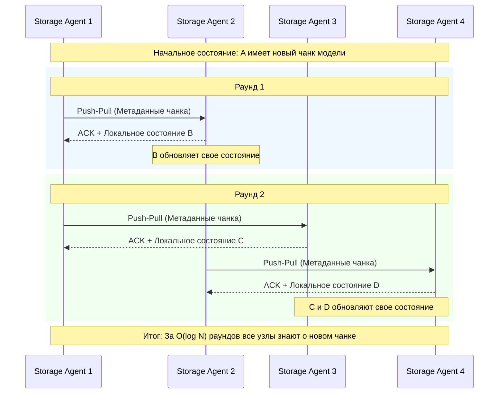

# Алгоритм Gossip (Epidemic Dissemination)

## Описание
Алгоритм Gossip (также известный как эпидемический протокол распространения информации) представляет собой децентрализованный метод обмена данными в распределенных системах, вдохновленный механизмами распространения эпидемий в биологических популяциях или слухов в социальных сетях. Основная идея заключается в том, что каждый узел системы периодически выбирает один или несколько случайных узлов из числа своих соседей и обменивается с ними информацией о своем текущем состоянии. Благодаря случайному выбору и экспоненциальному характеру распространения, информация быстро и надежно достигает всех участников сети, даже в условиях высокой динамичности топологии и частых сбоев отдельных узлов.

В контексте дипломной работы, посвященной оптимизации холодного старта и масштабирования моделей машинного обучения в бессерверном (serverless) инференсе, алгоритм Gossip рассматривался как мощная и отказоустойчивая альтернатива централизованному Redis-трекеру. В распределенной архитектуре, где множество экземпляров `storage-agent` отвечают за кэширование и предоставление доступа к весам ML-моделей (чанкам), критически важно иметь актуальную картину распределения данных. Использование централизованного хранилища метаданных, такого как Redis, может стать узким местом (bottleneck) при пиковых нагрузках, характерных для массового масштабирования serverless-функций. Gossip-протокол позволяет узлам `storage-agent` автономно обнаруживать друг друга и эффективно распространять метаданные о наличии тех или иных чанков моделей, снижая нагрузку на центральные компоненты и повышая общую надежность системы.

Процесс работы алгоритма можно разделить на несколько этапов. На каждом такте (gossip interval) узел случайным образом выбирает $k$ узлов (обычно $k=1$ или $k=2$) из своего локального списка известных пиров. Затем он инициирует сеанс связи, который может происходить по моделям Push (отправка своих обновлений), Pull (запрос чужих обновлений) или Push-Pull (двусторонний обмен). В нашей системе предпочтительна модель Push-Pull, так как она обеспечивает наилучшую скорость сходимости. Получив новые данные, узел обновляет свое локальное состояние, разрешая конфликты с помощью векторных часов (vector clocks) или временных меток (timestamps), и на следующем такте уже сам участвует в дальнейшем распространении этой обновленной информации.

## Сложность
**Временная сложность сходимости:** $O(\log N)$
Скорость распространения информации в Gossip-протоколах растет экспоненциально. Если в начальный момент времени только один узел владеет новой информацией, то на следующем шаге ею будут владеть уже 2 узла, затем 4, 8 и так далее. Таким образом, для того чтобы обновление достигло всех $N$ узлов в сети, потребуется количество раундов, пропорциональное логарифму от общего числа узлов. Это делает алгоритм исключительно масштабируемым: даже при увеличении кластера до десятков тысяч узлов время сходимости (convergence time) возрастает незначительно.

**Пространственная сложность:** $O(N)$ на каждый узел
Каждый узел `storage-agent` должен хранить локальное представление о состоянии системы, включая список известных пиров и метаданные о чанках, которыми они владеют. В худшем случае размер этой таблицы маршрутизации и метаданных линейно зависит от общего количества узлов $N$ в кластере. Однако на практике используются методы сжатия, фильтрации (например, Bloom filters) и частичного представления (partial views), что позволяет существенно снизить потребление памяти и сделать пространственную сложность сублинейной или константной для конкретных задач маршрутизации.

**Сетевая сложность (Network Overhead):** $O(N \log N)$ сообщений
Для полного распространения одного обновления по всей сети генерируется порядка $O(N \log N)$ сообщений. Хотя это больше, чем в оптимальных широковещательных деревьях ($O(N)$), избыточность сообщений является платой за высокую отказоустойчивость: выход из строя любого узла или потеря пакета не останавливает процесс распространения.

## Диаграмма



## Реализация на Go

Ниже представлен абстрактный, но рабочий фрагмент кода на языке Go, демонстрирующий базовую логику узла `storage-agent`, использующего Gossip-протокол для обмена метаданными о чанках ML-моделей.

```go
package gossip

import (
	"fmt"
	"math/rand"
	"sync"
	"time"
)

// ChunkMetadata описывает метаданные чанка ML-модели
type ChunkMetadata struct {
	ModelID   string
	ChunkID   string
	Timestamp int64
}

// NodeState представляет локальное состояние узла storage-agent
type NodeState struct {
	NodeID string
	Chunks map[string]ChunkMetadata
	mu     sync.RWMutex
}

// GossipNode представляет узел, участвующий в эпидемическом протоколе
type GossipNode struct {
	State       *NodeState
	Peers       []*GossipNode // В реальной системе здесь будут IP-адреса/URL
	Interval    time.Duration
	stopChannel chan struct{}
}

// NewGossipNode создает новый узел
func NewGossipNode(id string, interval time.Duration) *GossipNode {
	return &GossipNode{
		State: &NodeState{
			NodeID: id,
			Chunks: make(map[string]ChunkMetadata),
		},
		Peers:       make([]*GossipNode, 0),
		Interval:    interval,
		stopChannel: make(chan struct{}),
	}
}

// AddChunk добавляет информацию о новом чанке в локальное состояние
func (n *GossipNode) AddChunk(modelID, chunkID string) {
	n.State.mu.Lock()
	defer n.State.mu.Unlock()
	key := fmt.Sprintf("%s-%s", modelID, chunkID)
	n.State.Chunks[key] = ChunkMetadata{
		ModelID:   modelID,
		ChunkID:   chunkID,
		Timestamp: time.Now().UnixNano(),
	}
}

// Start запускает фоновый процесс обмена сплетнями
func (n *GossipNode) Start() {
	ticker := time.NewTicker(n.Interval)
	go func() {
		for {
			select {
			case <-ticker.C:
				n.gossip()
			case <-n.stopChannel:
				ticker.Stop()
				return
			}
		}
	}()
}

// gossip выполняет один раунд обмена состояниями со случайным пиром
func (n *GossipNode) gossip() {
	if len(n.Peers) == 0 {
		return
	}
	// Выбираем случайного соседа
	peerIndex := rand.Intn(len(n.Peers))
	peer := n.Peers[peerIndex]

	// Push-Pull обмен (в реальности это сетевой RPC/HTTP вызов)
	n.State.mu.RLock()
	localStateCopy := make(map[string]ChunkMetadata)
	for k, v := range n.State.Chunks {
		localStateCopy[k] = v
	}
	n.State.mu.RUnlock()

	// Отправляем свое состояние пиру и получаем его состояние
	peerState := peer.ReceiveGossip(localStateCopy)
	n.mergeState(peerState)
}

// ReceiveGossip обрабатывает входящий запрос от другого узла
func (n *GossipNode) ReceiveGossip(remoteState map[string]ChunkMetadata) map[string]ChunkMetadata {
	n.mergeState(remoteState)
	
	n.State.mu.RLock()
	defer n.State.mu.RUnlock()
	localStateCopy := make(map[string]ChunkMetadata)
	for k, v := range n.State.Chunks {
		localStateCopy[k] = v
	}
	return localStateCopy
}

// mergeState объединяет удаленное состояние с локальным на основе временных меток
func (n *GossipNode) mergeState(remoteState map[string]ChunkMetadata) {
	n.State.mu.Lock()
	defer n.State.mu.Unlock()
	for key, remoteMeta := range remoteState {
		localMeta, exists := n.State.Chunks[key]
		// Разрешение конфликтов: побеждает более новая запись (Last-Write-Wins)
		if !exists || remoteMeta.Timestamp > localMeta.Timestamp {
			n.State.Chunks[key] = remoteMeta
		}
	}
}

// Stop останавливает работу узла
func (n *GossipNode) Stop() {
	close(n.stopChannel)
}
```

## Применение в системе

В разработанной архитектуре бессерверного инференса машинного обучения алгоритм Gossip играет ключевую роль в обеспечении децентрализованного обнаружения узлов и маршрутизации запросов. Изначально для отслеживания того, на каком узле `storage-agent` закэширован конкретный чанк весов модели, использовался кластер Redis. Однако при массовом масштабировании (scale-out) тысяч serverless-функций, одновременно запрашивающих метаданные при холодном старте, Redis становился узким местом, требующим сложного шардирования и управления репликацией.

Внедрение Gossip-протокола позволило перенести ответственность за хранение и распространение метаданных непосредственно на сами узлы `storage-agent`. Когда компонент `storage-mounter` (отвечающий за монтирование весов в контейнер с ML-моделью) нуждается в определенном чанке, он обращается к локальному или ближайшему `storage-agent`. Благодаря постоянному фоновому обмену "сплетнями", этот агент уже обладает актуальной картой распределения чанков по всему кластеру Kubernetes. Если нужный чанк отсутствует локально, агент точно знает, к какому соседнему узлу перенаправить запрос, избегая обращения к централизованному трекеру.

Такой подход кардинально повышает отказоустойчивость системы. Выход из строя одного или нескольких узлов `storage-agent` (что является нормальным явлением в динамичной среде Kubernetes с preemptible/spot инстансами) не приводит к потере глобального состояния. Оставшиеся узлы быстро обнаруживают отсутствие соседей и обновляют свои таблицы маршрутизации в течение нескольких тактов Gossip-протокола. Кроме того, алгоритм естественным образом адаптируется к добавлению новых узлов при автомасштабировании: новому агенту достаточно узнать адрес хотя бы одного существующего узла (seed node), чтобы через $O(\log N)$ времени получить полную картину распределения данных в кластере и заявить о себе. Это существенно снижает задержки при холодном старте, так как устраняется необходимость синхронных обращений к внешним базам данных на критическом пути загрузки модели.