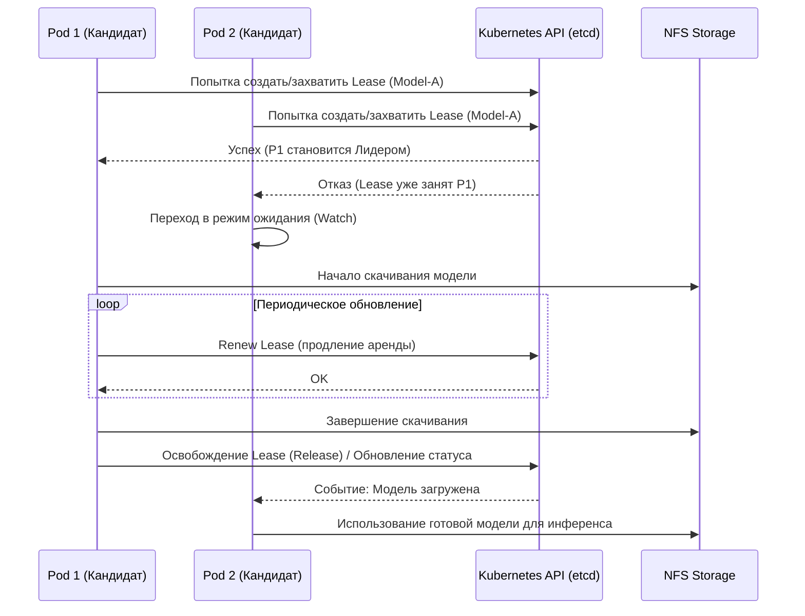

# Алгоритм Leader Election через Kubernetes Lease API

## Описание
В современных распределенных системах, особенно при работе в высоконагруженных облачных средах на базе Kubernetes, часто возникает острая необходимость строгой координации действий между несколькими экземплярами одного и того же микросервиса. В контексте платформ бессерверного инференса (serverless inference) для моделей машинного обучения проблема так называемого «холодного старта» усугубляется необходимостью загрузки объемных весов моделей (которые могут весить десятки гигабайт) из удаленного объектного хранилища. Если при резком масштабировании сервиса (scale-out) запускается сразу несколько подов (реплик), и каждый из них начнет параллельно скачивать одну и ту же модель в общее сетевое хранилище (например, NFS), это неминуемо приведет к избыточной нагрузке на сеть, дублированию дорогостоящих операций ввода-вывода и потенциальным конфликтам при записи файлов.

Для элегантного и надежного решения этой проблемы применяется классический паттерн распределенных систем — «Выборы лидера» (Leader Election). Суть данного алгоритма заключается в том, что из группы равноправных вычислительных узлов (подов) динамически выбирается только один — лидер. Именно этот лидер берет на себя эксклюзивную ответственность за выполнение критической, ресурсоемкой операции (в нашем случае — скачивание весов модели в NFS). Остальные узлы переходят в пассивный режим ожидания и непрерывного мониторинга состояния лидера.

В экосистеме Kubernetes реализация данного паттерна решается с использованием встроенного, оптимизированного механизма Lease API (ресурс `coordination.k8s.io/v1/leases`). Алгоритм работает следующим образом:
1. Все поды, участвующие в процессе подготовки модели, пытаются создать или обновить специфический объект Lease в кластере Kubernetes.
2. Kubernetes API Server, используя etcd в качестве строго консистентного хранилища (с поддержкой механизма оптимистичной блокировки через поле `resourceVersion`), математически гарантирует, что только один запрос на захват лидерства будет успешным.
3. Под, успешно захвативший Lease, официально становится лидером. Он начинает выполнять полезную работу (скачивание модели) и обязан периодически обновлять (renew) объект Lease, подтверждая свою работоспособность и сетевую доступность.
4. Остальные поды становятся наблюдателями. Они периодически опрашивают состояние объекта Lease. Если лидер падает, зависает или теряет связь с API-сервером, он перестает обновлять Lease. По истечении заданного времени (LeaseDuration) объект считается просроченным, и наблюдатели снова вступают в конкурентную борьбу за лидерство.

Такой подход абсолютно не требует развертывания дополнительных тяжеловесных сервисов координации (таких как Apache ZooKeeper, HashiCorp Consul или кластер Redis), так как использует уже существующую, высоконадежную инфраструктуру control plane Kubernetes, обеспечивая исключительную отказоустойчивость.

## Сложность
**Временная сложность:**
- **Захват лидерства (Acquire):** $O(1)$ с точки зрения клиента, так как это представляет собой один HTTP-запрос к Kubernetes API. На стороне etcd сложность также строго $O(1)$ для операции записи с проверкой версии ключа.
- **Обновление (Renew):** $O(1)$ — легковесный периодический HTTP-запрос для продления аренды.
- **Ожидание (Wait/Observe):** $O(1)$ на каждую проверку. При использовании механизма Kubernetes Watch (подписка на потоковые события) сложность обработки события также составляет $O(1)$, что полностью исключает необходимость агрессивного поллинга (polling) и радикально снижает нагрузку на API-сервер кластера.

**Пространственная сложность:**
- $O(1)$ для каждого пода, так как в оперативной памяти необходимо хранить только минимальные метаданные о текущем лидере и состоянии объекта Lease (идентификатор лидера, время истечения аренды). В базе данных etcd также хранится ровно один небольшой объект Lease на каждую группу координации (например, на каждую уникальную модель машинного обучения), что в масштабах кластера дает $O(M)$, где $M$ — количество одновременно загружаемых уникальных моделей.

## Диаграмма



## Реализация на Go

Ниже представлен абстрактный, но полностью рабочий фрагмент кода на языке Go, демонстрирующий использование официального пакета `client-go` для реализации алгоритма Leader Election при скачивании модели.

```go
package main

import (
	"context"
	"fmt"
	"log"
	"os"
	"time"

	metav1 "k8s.io/apimachinery/pkg/apis/meta/v1"
	"k8s.io/client-go/kubernetes"
	"k8s.io/client-go/rest"
	"k8s.io/client-go/tools/leaderelection"
	"k8s.io/client-go/tools/leaderelection/resourcelock"
)

// ModelDownloader отвечает за загрузку весов модели в общее хранилище NFS
type ModelDownloader struct {
	ModelID string
	NFSPath string
}

// Download имитирует процесс загрузки больших файлов
func (m *ModelDownloader) Download(ctx context.Context) error {
	log.Printf("Начало скачивания модели %s в директорию %s...", m.ModelID, m.NFSPath)
	// Имитация длительного сетевого процесса скачивания
	select {
	case <-time.After(15 * time.Second):
		log.Printf("Модель %s успешно скачана и сохранена", m.ModelID)
		return nil
	case <-ctx.Done():
		log.Printf("Процесс скачивания модели %s был принудительно прерван", m.ModelID)
		return ctx.Err()
	}
}

func main() {
	modelID := "resnet50-v1"
	leaseName := fmt.Sprintf("model-download-%s", modelID)
	leaseNamespace := "serverless-inference"
	
	// Получаем уникальный идентификатор текущего пода из переменных окружения
	podName := os.Getenv("POD_NAME")
	if podName == "" {
		podName = "unknown-pod-identity"
	}

	// Инициализация in-cluster клиента Kubernetes
	config, err := rest.InClusterConfig()
	if err != nil {
		log.Fatalf("Критическая ошибка конфигурации K8s: %v", err)
	}
	clientset, err := kubernetes.NewForConfig(config)
	if err != nil {
		log.Fatalf("Ошибка создания клиента K8s: %v", err)
	}

	// Настройка механизма блокировки на основе Lease API
	lock := &resourcelock.LeaseLock{
		LeaseMeta: metav1.ObjectMeta{
			Name:      leaseName,
			Namespace: leaseNamespace,
		},
		Client: clientset.CoordinationV1(),
		LockConfig: resourcelock.ResourceLockConfig{
			Identity: podName,
		},
	}

	ctx, cancel := context.WithCancel(context.Background())
	defer cancel()

	downloader := &ModelDownloader{
		ModelID: modelID,
		NFSPath: "/mnt/nfs/models/" + modelID,
	}

	// Конфигурация параметров Leader Election
	leConfig := leaderelection.LeaderElectionConfig{
		Lock:            lock,
		ReleaseOnCancel: true,
		LeaseDuration:   15 * time.Second,
		RenewDeadline:   10 * time.Second,
		RetryPeriod:     2 * time.Second,
		Callbacks: leaderelection.LeaderCallbacks{
			OnStartedLeading: func(ctx context.Context) {
				log.Printf("Под %s успешно стал лидером. Начинаем загрузку...", podName)
				if err := downloader.Download(ctx); err != nil {
					log.Printf("Ошибка при загрузке модели: %v", err)
				}
				// После успешной загрузки завершаем контекст, чтобы освободить Lease
				cancel()
			},
			OnStoppedLeading: func() {
				log.Printf("Под %s потерял статус лидера", podName)
			},
			OnNewLeader: func(identity string) {
				if identity == podName {
					return
				}
				log.Printf("Новый лидер успешно выбран: %s. Ожидаем завершения загрузки...", identity)
			},
		},
	}

	// Запуск цикла координации
	leaderelection.RunOrDie(ctx, leConfig)
	log.Println("Процесс координации успешно завершен. Модель готова к использованию для инференса.")
}
```

## Применение в системе

В рамках разработанной архитектуры платформы бессерверного инференса, алгоритм Leader Election через Kubernetes Lease API играет абсолютно критическую роль на этапе подготовки окружения (так называемый NFS-этап). Когда система получает внезапный всплеск пользовательских запросов (burst traffic) к модели, которая в данный момент не загружена в оперативную память ни одного из вычислительных узлов (возникает ситуация холодного старта), автомасштабатор (например, KEDA или Knative) мгновенно реагирует и создает сразу несколько реплик подов-обработчиков (компонент `storage-agent`).

Если бы каждый из этих вновь созданных подов попытался самостоятельно и независимо скачать веса модели (размер которых может достигать нескольких десятков гигабайт) из S3-совместимого объектного хранилища на общий примонтированный NFS-диск, это привело бы к катастрофической деградации общей производительности кластера. Сетевой канал был бы моментально перегружен дублирующимся паразитным трафиком, а NFS-сервер столкнулся бы с тяжелыми конфликтами блокировок файлов при одновременной записи одних и тех же данных из разных источников.

Внедрение описанного алгоритма решает эту сложную инженерную проблему максимально элегантно и эффективно. При старте все реплики `storage-agent` немедленно инициируют процесс Leader Election, используя уникальное имя запрашиваемой модели в качестве идентификатора ресурса Lease. Тот под, который благодаря сетевой топологии первым обращается к Kubernetes API и успешно захватывает Lease, официально назначается лидером. Он начинает потоковую загрузку весов модели из S3 в NFS.

Остальные поды, получив закономерный отказ в захвате Lease, переходят в энергоэффективный режим ожидания. Они подписываются на изменения объекта Lease через механизм Watch или периодически проверяют наличие специального флага готовности (например, файла-маркера `.ready` в директории модели на NFS-диске). Как только лидер успешно завершает загрузку, он создает этот файл-маркер и добровольно освобождает Lease. Ожидающие поды мгновенно обнаруживают готовность модели, монтируют директорию и приступают к загрузке весов непосредственно в оперативную память (RAM) GPU или CPU для последующего выполнения инференса.

В случае непредвиденного сбоя лидера (например, под был принудительно убит OOM Killer'ом из-за нехватки памяти, или физический узел кластера внезапно вышел из строя), процесс фонового обновления Lease прекращается. По истечении таймаута `LeaseDuration` (в нашем примере это 15 секунд), Kubernetes API автоматически помечает Lease как свободный. Один из ожидающих подов немедленно захватывает лидерство, проверяет целостность уже скачанных данных (например, сверяя криптографические чексуммы или размер файла) и возобновляет загрузку ровно с прерванного места. Это обеспечивает высочайшую отказоустойчивость системы и гарантирует, что модель будет загружена даже в условиях крайне нестабильной инфраструктуры, минимизируя общее время холодного старта.

Использование встроенного в Kubernetes механизма Lease API полностью избавляет от необходимости развертывания и сложной поддержки внешних систем распределенных блокировок (таких как Redis Redlock или Apache ZooKeeper), что существенно упрощает архитектуру, снижает накладные расходы на эксплуатацию и идеально вписывается в современную cloud-native парадигму разработанного дипломного решения.