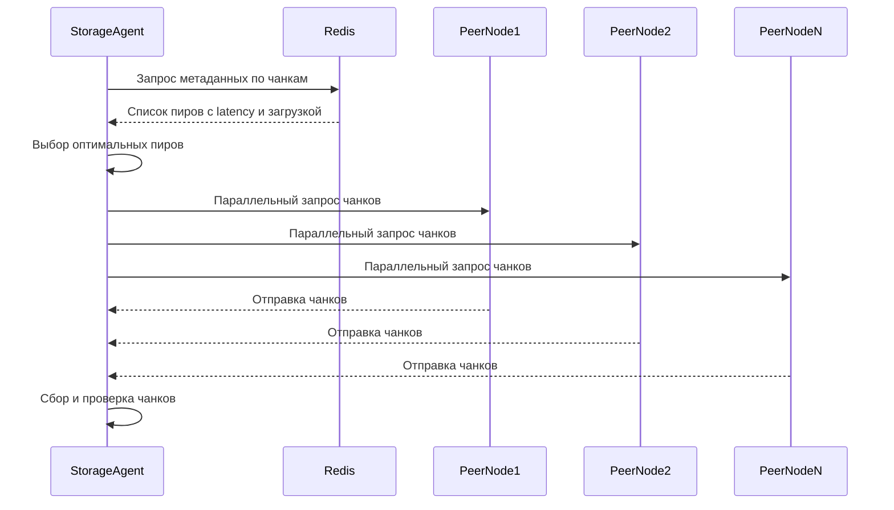

# Алгоритм параллельного скачивания чанков с выбором оптимального пира (Peer Selection)

## Описание

Алгоритм параллельного скачивания чанков с выбором оптимального пира предназначен для эффективного получения данных в условиях cache miss, возникающего в бессерверной среде инференса моделей машинного обучения. В рамках архитектуры системы, реализующей оптимизацию холодного старта и масштабирования, storage-agent при отсутствии нужных данных в локальном кэше обращается к распределённому хранилищу. Для минимизации времени отклика и повышения надёжности загрузки данных необходимо максимально рационально выбрать источники (пиры), с которых будут скачиваться чанки модели.

Входной сигнал — запрос на загрузку набора чанков модели, отсутствующих в локальном кэше. Алгоритм запрашивает у Redis метаданные, содержащие список нод (пиров), которые имеют необходимые чанки. Каждая нода характеризуется показателями, такими как latency (задержка отклика) и текущая загрузка (CPU, сеть). На основе этих метрик происходит выбор оптимального подмножества пиров для скачивания, что позволяет одновременно загружать чанки параллельно, минимизируя время ожидания и снижая нагрузку на отдельные узлы.

Параллелизм реализуется с помощью конструкции `errgroup` из Go, обеспечивающей запуск и контроль нескольких горутин для скачивания чанков. Такой подход позволяет эффективно использовать ресурсы сети и вычислительные мощности, одновременно обрабатывая множество загрузок, при этом контролируя ошибки и обеспечивая корректное завершение процесса.

Алгоритм применяется в контексте дипломной работы для минимизации времени холодного старта моделей машинного обучения в бессерверных средах, где задержки при загрузке данных критичны. Оптимальный выбор пиров и параллельное скачивание существенно сокращают общее время получения модели, повышая отзывчивость и масштабируемость системы.

## Сложность

Временная сложность алгоритма определяется двумя основными этапами: выбором оптимальных пиров и параллельным скачиванием чанков.

- Выбор оптимальных пиров требует обхода списка доступных нод с чанками. Если количество нод равно N, то сложность выбора оптимальных пиров — O(N), так как необходимо оценить метрики (latency, загрузка) каждой ноды для принятия решения.
- Скачивание происходит параллельно, что с точки зрения алгоритмической сложности для каждой операции загрузки — O(1), однако суммарное время зависит от сетевых задержек и пропускной способности.

Таким образом, общая временная сложность алгоритма — O(N), где N — число доступных пиров. Параллелизм уменьшает реальное время выполнения, но не асимптотическую сложность.

Пространственная сложность связана с хранением списка метаданных и управления состояниями параллельных операций. Для списка из N пиров и M чанков, пространственная сложность — O(N + M), где N — число пиров, M — количество чанков. Это обусловлено хранением информации о пирах и состоянии загрузки каждого чанка.

## Диаграмма



## Реализация на Go

```go
package main

import (
    "context"
    "fmt"
    "sync"
    "time"

    "golang.org/x/sync/errgroup"
)

// PeerMeta содержит метаданные по пиру
type PeerMeta struct {
    Address string
    Latency time.Duration
    Load    float64
}

// ChunkID идентификатор чанка
type ChunkID string

// StorageAgent отвечает за загрузку чанков
type StorageAgent struct {
    redisClient RedisClient
}

// RedisClient интерфейс для получения метаданных из Redis
type RedisClient interface {
    GetPeersForChunks(ctx context.Context, chunks []ChunkID) (map[ChunkID][]PeerMeta, error)
}

// downloadChunk имитирует скачивание чанка с пира
func downloadChunk(ctx context.Context, peer PeerMeta, chunk ChunkID) error {
    // Симуляция задержки, зависящей от latency и случайной загрузке
    simulatedDelay := peer.Latency + time.Duration(peer.Load*100)*time.Millisecond
    select {
    case <-time.After(simulatedDelay):
        fmt.Printf("Chunk %s скачан с %s\n", chunk, peer.Address)
        return nil
    case <-ctx.Done():
        return ctx.Err()
    }
}

// selectOptimalPeer выбирает оптимального пира для чанка по минимальной задержке и загрузке
func selectOptimalPeer(peers []PeerMeta) PeerMeta {
    var optimal PeerMeta
    minScore := float64(1<<63 - 1) // Максимальное значение float64 для сравнения
    for _, p := range peers {
        // Простая метрика: latency + load*weight
        score := float64(p.Latency.Milliseconds()) + p.Load*1000
        if score < minScore {
            minScore = score
            optimal = p
        }
    }
    return optimal
}

// DownloadChunks параллельно скачивает чанки с оптимальных пиров
func (sa *StorageAgent) DownloadChunks(ctx context.Context, chunks []ChunkID) error {
    peersMap, err := sa.redisClient.GetPeersForChunks(ctx, chunks)
    if err != nil {
        return fmt.Errorf("ошибка получения пиров: %w", err)
    }

    g, ctx := errgroup.WithContext(ctx)
    var mu sync.Mutex
    for _, chunk := range chunks {
        peers, ok := peersMap[chunk]
        if !ok || len(peers) == 0 {
            return fmt.Errorf("нет доступных пиров для чанка %s", chunk)
        }
        optimalPeer := selectOptimalPeer(peers)

        chunkCopy := chunk
        peerCopy := optimalPeer

        g.Go(func() error {
            if err := downloadChunk(ctx, peerCopy, chunkCopy); err != nil {
                return err
            }
            mu.Lock()
            // Здесь можно обновить локальный кэш или состояние
            mu.Unlock()
            return nil
        })
    }

    if err := g.Wait(); err != nil {
        return fmt.Errorf("ошибка при скачивании чанков: %w", err)
    }
    return nil
}
```

## Применение в системе

Данный алгоритм является ключевым компонентом механизма оптимизации холодного старта моделей машинного обучения в бессерверной архитектуре. При первом запросе модели, отсутствующей в локальном кэше storage-agent инициирует процесс загрузки. Сначала он обращается к Redis, где хранится актуальная информация о нодах, имеющих необходимые чанки модели. Redis выступает как централизованный метадейтектор, обеспечивая быстрое получение списков пиров и их метрик.

Выбор оптимальных пиров на основе latency и загрузки позволяет избежать узких мест и избыточной нагрузки на отдельные ноды, что особенно актуально в Kubernetes-кластере с динамически меняющейся нагрузкой и масштабом. Параллельное скачивание чанков через errgroup снижает общее время загрузки, эффективно используя сетевые ресурсы и сокращая время отклика системы.

После успешной загрузки всех чанков storage-agent собирает их, проверяет целостность и обновляет локальный кэш, что позволяет последующим запросам к модели обрабатываться мгновенно, без обращения к внешним источникам. Таким образом, алгоритм напрямую влияет на производительность системы, снижая задержки холодного старта и повышая масштабируемость при увеличении числа одновременных запросов к ML-моделям.

Кроме того, гибкость выбора пиров и параллельность загрузки позволяют адаптироваться к изменяющимся условиям сети и нагрузке в реальном времени, что критично для бессерверных систем с высокими требованиями к отказоустойчивости и скорости реакции.

В совокупности с другими компонентами архитектуры алгоритм обеспечивает сбалансированное использование ресурсов и максимизирует эффективность процесса инференса машинного обучения в распределённой бессерверной среде, что и является основной целью дипломной работы.