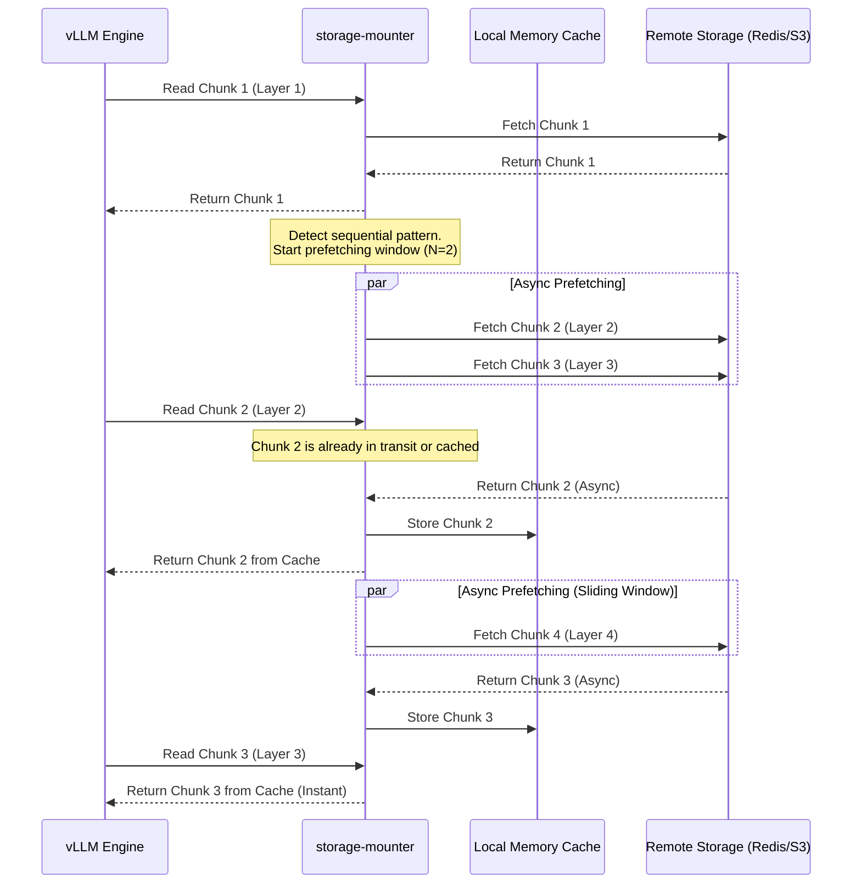

# Алгоритм Prefetching (упреждающее чтение) на основе последовательного паттерна доступа

## Описание

Алгоритм упреждающего чтения (Prefetching) представляет собой метод оптимизации ввода-вывода, направленный на минимизацию задержек при доступе к данным за счет их предварительной загрузки в кэш или оперативную память до того, как они будут фактически запрошены приложением. В контексте бессерверного инференса и работы с большими языковыми моделями (LLM), такими как те, что обслуживаются с помощью vLLM, проблема сетевой задержки при загрузке весов модели стоит особенно остро. Веса современных моделей могут занимать десятки и сотни гигабайт, и их загрузка по сети при каждом "холодном старте" контейнера приводит к неприемлемо долгому времени инициализации.

Ключевой особенностью работы движков инференса, таких как vLLM, является детерминированный и строго последовательный паттерн доступа к весам модели во время ее загрузки в память GPU. Модель загружается слой за слоем (layer by layer), что означает, что после запроса чанка данных, содержащего $i$-й слой, с вероятностью, близкой к 100%, следующим будет запрошен чанк с $(i+1)$-м слоем. 

Алгоритм Prefetching на основе последовательного паттерна доступа использует эту предсказуемость. Компонент `storage-mounter`, выступающий в роли прослойки между файловой системой контейнера и удаленным хранилищем (например, S3 или распределенным кэшем на базе Redis), непрерывно анализирует поток запросов на чтение (read requests). Обнаружив последовательное чтение, алгоритм асинхронно инициирует фоновые запросы на загрузку следующих $N$ чанков данных. К моменту, когда vLLM фактически запрашивает эти чанки, они уже находятся в локальном кэше `storage-mounter` или в оперативной памяти узла. Таким образом, сетевая задержка (network latency) полностью скрывается за временем обработки предыдущих слоев, и приложение воспринимает скорость чтения так, как если бы данные находились на локальном NVMe-накопителе.

Этот подход критически важен для оптимизации холодного старта, так как он позволяет распараллелить процессы вычисления (инициализации слоев в GPU) и ввода-вывода (загрузки следующих слоев по сети), максимизируя утилизацию пропускной способности сети и минимизируя время простоя вычислительных ресурсов.

## Сложность

**Временная сложность:**
- **Анализ паттерна и принятие решения:** $O(1)$. Для каждого запроса на чтение алгоритму достаточно проверить смещение (offset) и сравнить его с ожидаемым следующим смещением на основе истории предыдущих запросов. Это требует константного времени.
- **Поиск в кэше:** $O(1)$ при использовании хэш-таблиц для хранения предзагруженных чанков.
- **Асинхронная загрузка:** $O(S / B)$, где $S$ — размер чанка, а $B$ — пропускная способность сети. Однако, поскольку загрузка происходит асинхронно в фоновых горутинах, она не блокирует основной поток выполнения, и эффективное время ожидания для приложения стремится к $O(1)$ (при условии, что скорость сети достаточна для опережения скорости обработки данных приложением).

**Пространственная сложность:**
- $O(N \times S)$, где $N$ — размер окна упреждающего чтения (количество предзагружаемых чанков), а $S$ — размер одного чанка. Алгоритм требует выделения буферов в оперативной памяти для хранения предзагруженных данных до момента их востребования приложением. Размер окна $N$ является настраиваемым параметром и должен балансировать между агрессивностью предзагрузки (для скрытия больших задержек) и доступным объемом оперативной памяти на узле.

## Диаграмма



## Реализация на Go

Ниже представлена абстрактная, но рабочая реализация логики упреждающего чтения на языке Go в контексте компонента `storage-mounter`.

```go
package prefetcher

import (
	"context"
	"fmt"
	"sync"
	"time"
)

// Chunk представляет блок данных весов модели
type Chunk struct {
	ID   int
	Data []byte
}

// RemoteStorage абстракция удаленного хранилища (например, Redis или S3)
type RemoteStorage interface {
	FetchChunk(ctx context.Context, chunkID int) (*Chunk, error)
}

// Prefetcher реализует алгоритм упреждающего чтения
type Prefetcher struct {
	storage       RemoteStorage
	cache         map[int]*Chunk
	mu            sync.Mutex
	prefetchWin   int
	lastRequested int
	inFlight      map[int]bool
	cond          *sync.Cond
}

// NewPrefetcher создает новый экземпляр Prefetcher
func NewPrefetcher(storage RemoteStorage, windowSize int) *Prefetcher {
	p := &Prefetcher{
		storage:       storage,
		cache:         make(map[int]*Chunk),
		prefetchWin:   windowSize,
		lastRequested: -1,
		inFlight:      make(map[int]bool),
	}
	p.cond = sync.NewCond(&p.mu)
	return p
}

// ReadChunk запрашивается приложением (vLLM)
func (p *Prefetcher) ReadChunk(ctx context.Context, chunkID int) (*Chunk, error) {
	p.mu.Lock()
	
	// Обновляем паттерн доступа и запускаем префетчинг
	p.lastRequested = chunkID
	p.triggerPrefetch(ctx, chunkID)

	// Ждем, пока чанк появится в кэше
	for {
		if chunk, exists := p.cache[chunkID]; exists {
			// Удаляем из кэша после чтения для экономии памяти
			delete(p.cache, chunkID)
			p.mu.Unlock()
			return chunk, nil
		}
		
		// Если чанк не загружается, инициируем синхронную загрузку (fallback)
		if !p.inFlight[chunkID] {
			p.inFlight[chunkID] = true
			p.mu.Unlock()
			
			chunk, err := p.storage.FetchChunk(ctx, chunkID)
			
			p.mu.Lock()
			delete(p.inFlight, chunkID)
			if err == nil {
				p.cache[chunkID] = chunk
				p.cond.Broadcast()
			}
			p.mu.Unlock()
			
			if err != nil {
				return nil, err
			}
			p.mu.Lock()
		} else {
			// Ждем завершения асинхронной загрузки
			p.cond.Wait()
		}
	}
}

// triggerPrefetch асинхронно запрашивает следующие N чанков
func (p *Prefetcher) triggerPrefetch(ctx context.Context, currentChunkID int) {
	for i := 1; i <= p.prefetchWin; i++ {
		nextChunkID := currentChunkID + i
		
		if _, cached := p.cache[nextChunkID]; cached {
			continue
		}
		if p.inFlight[nextChunkID] {
			continue
		}
		
		p.inFlight[nextChunkID] = true
		
		// Запускаем фоновую горутину для загрузки
		go func(cID int) {
			// Имитация таймаута контекста для фоновой задачи
			bgCtx, cancel := context.WithTimeout(context.Background(), 10*time.Second)
			defer cancel()
			
			chunk, err := p.storage.FetchChunk(bgCtx, cID)
			
			p.mu.Lock()
			defer p.mu.Unlock()
			
			delete(p.inFlight, cID)
			if err == nil {
				p.cache[cID] = chunk
				p.cond.Broadcast() // Будим ожидающие горутины
			} else {
				fmt.Printf("Failed to prefetch chunk %d: %v\n", cID, err)
			}
		}(nextChunkID)
	}
}
```

## Применение в системе

В разработанной архитектуре бессерверного инференса алгоритм Prefetching интегрирован непосредственно в компонент `storage-mounter`, который реализует интерфейс файловой системы (FUSE или CSI драйвер) для подов Kubernetes. Когда планировщик Kubernetes запускает новый под с контейнером vLLM для обработки внезапного всплеска трафика (scale-from-zero), vLLM начинает инициализацию и монтирует виртуальный том с весами модели.

Процесс инициализации vLLM включает чтение конфигурационных файлов, а затем последовательное чтение файлов тензоров (например, `.safetensors` или `.bin`), которые логически разбиты на слои нейронной сети. `storage-mounter` перехватывает системные вызовы `read()` на уровне файловой системы. Поскольку файлы весов огромны, они разбиты на чанки фиксированного размера (например, по 16 МБ или 32 МБ), которые хранятся в распределенном кэше на базе Redis (управляемом компонентом `storage-agent`) или в объектном хранилище S3.

Как только `storage-mounter` обслуживает первый запрос на чтение нулевого смещения файла, алгоритм Prefetching распознает начало последовательного сканирования. Он немедленно формирует окно упреждающего чтения (например, $N=10$ чанков) и отправляет асинхронные gRPC-запросы к `storage-agent` или напрямую в Redis для извлечения следующих блоков данных. 

Пока vLLM загружает первый слой в память GPU и выполняет необходимые преобразования форматов или деквантизацию, сеть активно передает следующие слои в фоновом режиме. К моменту, когда vLLM завершает обработку первого слоя и запрашивает следующий, соответствующие данные уже находятся в оперативной памяти узла (в буферах `storage-mounter`). Это позволяет отдавать данные приложению с задержкой, равной скорости копирования памяти (memory copy), полностью исключая сетевые задержки (RTT) из критического пути инициализации.

Такой подход решает одну из главных проблем бессерверного инференса LLM — "штраф" за холодный старт. За счет агрессивного упреждающего чтения и утилизации доступной пропускной способности сети (которая в современных дата-центрах может достигать 100 Гбит/с и более), время загрузки модели весом 40 ГБ сокращается с нескольких минут до считанных секунд. Это делает возможным динамическое масштабирование тяжелых моделей машинного обучения в ответ на изменения нагрузки в реальном времени, обеспечивая высокую утилизацию кластера и снижение затрат на инфраструктуру. Кроме того, алгоритм адаптивен: размер окна $N$ может динамически подстраиваться под текущую загруженность сети и доступный объем RAM на узле Kubernetes, предотвращая переполнение памяти (OOM) и деградацию производительности соседних контейнеров.